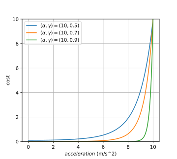

## Introduction

For this project, we will generate a set of waypoints which constitute a reference trajectory for an autonomous vehicle in [this simulator](https://github.com/udacity/self-driving-car-sim/releases/tag/T3_v1.2). The goal is to design a reference trajectory which the car can reasonably track while 

1. satisfying |velocity| <= 22.352 m/s (50 mph)
2. satisfying |acceleration| <= 10 m/s^2
3. satisfying |jerk| <= 10 m/s^3
4. remaining on the correct side of the road 
5. avoiding collisions with other cars
6. spending less than 3 seconds to perform lane change maneuvers

Typically you would want to prioritize safety above the "comfort" considerations, such as the jerk bounds. However, for our problem we require that all of the above constraints be satisfied. In practice this might occasionally lead to an infeasible problem, but we did not encounter that issue during simulation. 

## Coordinate Systems and Waypoint Tracking 

Traditionally, you would want to generate the waypoints in an inertial Cartesian coordinate system $(x,y)$. The reason is that derivatives (such as the velocity, acceleration, and jerk) are much easier to compute in this coordinate system. However, for autonomous driving, staying in our lane is obviously of paramount importance. Thus it makes sense to design our trajectories in the Frenet coordinates $(s,d)$, where $s$ denotes the distance "along" the road, and $d$ denotes are distance orthogonal to the road direction.

Furthermore, since the lanes are fixed width (4m), and there are 3 lanes throughout the track, setting a trajectory which stays in lane $i$ is equivalent to saying that the trajectory should have a constant $d$ value of $2 + 4i$, where $i=0$ denotes the rightmost lane, and $i = 2$ denotes the leftmost lane.

### Map Refinement

One of the issues that arises, however, is that the simulator requires a set of waypoints for the car to follow, and these waypoints must be specified in an inertial frame. So we need some way of converting from these Frenet coordinates $(s,d)$, where we would like to design the trajectory, back into inertial coordinates $(x,y)$. The question is how to do this smoothly. Specifically, the track map's waypoints (the data in the file `data/highway_map.csv`) are relatively coarse, meaning that for an arbitrary position on the map, it is not easy to generate a "smooth" map. From a zoomed out view of the track, it may not be apparent:

But if we zoom into a portion of the track, we would see the coarseness on full display. Therefore we refined the map's waypoints by a factor of 20 by simply fitting splines to the map and sampling at a higher frequency (you can see the details in `frenet.h`). If we compare the original map to the refined map, the change in smoothness is stark:

> We mention our concerns about smoothness because if we don't, then the non-smoothness of the map will manifest itself in the trajectory, causing large accelerations and jerks which violate the constraints. Thus addressing this issue really is of paramount concern. 

### Waypoint Processing 

It is critical to understand how the simulator is processing our waypoints. This is a little bit vague in the simulator description, but essentially the simulator will send us an updated estimate of the $(x,y)$ and $(s,d)$ positions of our car and the other cars on the road, as well as the $(x,y)$ velocities. Then the simulator sits and waits for a response containing waypoints that the car should follow. While waiting for our response, the simulator uses the waypoints that we passed at the previous iteration at a rate of 50Hz. If the simulator runs out of waypoints, the car will simply come to a dead stop. 

> The reason I say that this is vague is that we are supposed to meet the velocity, acceleration, and jerk constraints specified above. However, the simulator does not specify how it is following the waypoints. Technically, any discontinuous piecewise path is not smooth, so these derivatives are not even defined. How the simulator decides whether we are violating these bounds is thus undefined. 

Therefore, since the acceleration and jerk associated with going from a moderate speed to a dead stop will violate the acceleration and jerk constraints, we want to make sure that we are providing the simulator enough waypoints to use while we compute the trajectory at the next iteration. In our case, we use $N = 40$ waypoints, meaning that we leave ourselves 0.8 seconds to compute the next update iteration. 

The other issue of concern is how we should design our waypoints. There are essentially two logical options:

1. At every iteration, we design a completely new trajectory (containing $N$ waypoints). 
2. At every iteration, we simply "complete" the previous trajectory so that it contains $N$ waypoints. For instance, if since the last update, the simulator ran through 6 waypoints, then there will be $N-6$ waypoints left (and which will be used up if we don't provide an update). Instead of redesigning the complete trajectory, we will simply compute 6 waypoints to add to the end of the unused trajectory, and then pass this completed list of $N$ points back to the simulator. 

After initially trying option 1, I realized that it is not viable because more of the previous waypoints will have been consumed while generating the new trajectory. Thus the initial conditions for the new trajectory will have changed by the time we finish computing it. This can lead to high accelerations and jerks which violate the constraints. Hence it appears that we have to use option 2. 

## Reference trajectory parameterization

Suppose that at time $t^\star$, we are given new information about the other cars on the road, as well as our own. Therefore we will update our reference trajectory to reflect this new information. We can assume that the previous trajectory $\underline{p}(t)$ that we were using satisfied all of the constraints, but now we want to replace that trajectory with a new trajectory $p(t)$ which satisfies the updated constraints in light of the new information we received. For example, with the updated information about other vehicles, we want to make sure that we avoid collisions. 

As a first step in accomplishing this, we need to be very careful to make sure that when switching from the old trajectory $\underline{p}$ to the new trajectory $p$ that we do not violate the velocity, acceleration, and jerk constraints. Once we have figured out how to do that, we address the other constraints.

### Smoothness at the transitions

We need to make sure that the transition between trajectories is smooth up to some derivative. For instance, suppose that at time $t^{\star}$, we tried to move from the old trajectory $\underline{p}(t)= 0$ to the new trajectory $p(t)=1$. That would look like this:                

This is an example of a bad transition since it is physically impossible for the car to move from trajectory $\underline{p}$ to trajectory $p$ at time $t^{\star}$ without a teleportation device. So we have to make sure to avoid such transitions. 

However, we also have to be concerned about this problem in the higher derivatives. Why? Suppose that at time $t^{\star}$, we tried to move from the old trajectory $\underline{p}(t)= 0$ to the new trajectory $p(t)=t-t^\star$:

Sure this looks fine in terms of the position, but if we look at the velocity profile ($\dot{\underline{p}}(t)=0$, $\dot{p}(t)=1$):

then it becomes apparent that we would need to instantaneously change from one velocity to the another. Impossible again!  

We could permit discontinuities in the acceleration since we can directly specify it. However, if the acceleration is discontinuous, then the jerk will be undefined at the transition point $t^\star$. Therefore we will also force the acceleration to be continuous at the transition point. 

### Parameterization

We are going to try to satisfy these smoothness constraints (and subsequent constraints) by parameterizing the $s$ and $d$ trajectories thusly:
$$
s(t) = \delta_s + v_s  t + \beta_s  e^{-t|b_s|-t \epsilon} + \gamma_s e^{-t|g_s|-t\epsilon}
\\
d(t) = d_0 - \delta_d ( e^{-t} - 1) - \beta_d (e^{-t  |b_d|-t \epsilon} - 1) - \gamma_d ( e^{-t |g_d | -t \epsilon} - 1)
$$

where $t$ denotes the *time since the last transition point*, $\epsilon>0$ is some fixed small value, and the rest of the parameters $\delta_s, v_s, \ldots$ are free parameters that we will design to meet our goals. 

Although you will often see polynomial parameterizations, they suffer an extreme disadvantage... they will grow without bound. For instance, when designing a trajectory for the $d$-direction it makes sense that we would want to transition from lane $i$ at time $0$ to some other lane $j$ that we will stay in for the foreseeable future (that is, as $t\rightarrow \infty$). You simply can't capture that behavior with a polynomial. Similarly, we would ideally like to go from some initial $s$-velocity $\dot{s}_0$ to some terminal $s$-velocity that we will use for the foreseeable future (again, as $t\rightarrow \infty$). You can only get that behavior with a first-order polynomial, and that dose not give you very much wiggle room to meet your other constraints. As we will see, meeting these goals is easy with the above parameterization...

The first thing you should notice is that in each of our parameterizations, we have 6 free parameters. Furthermore, for each of these parameterizations, we want to meet 3 initial condition constraints:

$s(0) = \underline{s}(t^\star) = s_0$

$\dot{s}(0) = \underline{\dot{s}}(t^\star) = \dot{s}_0$

$\ddot{s}(0) = \underline{\ddot{s}}(t^\star) = \ddot{s}_0$

$d(0) = \underline{d}(t^\star) = d_0$

$\dot{d}(0) = \underline{\dot{d}}(t^\star) = \dot{d}_0$

$\ddot{d}(0) = \underline{\ddot{d}}(t^\star) = \ddot{d}_0$

To meet these constraints, you can choose fix 3 of the 6 parameters in each parameterization to meet this goal. Furthermore, due to the exponentials in the parameterization, it is easy to reason about the asymptotic behavior of these parameterizations. For more details see `cost.h`.

## Cost

So far, all we have done is to develop a stable parameterization which has desirable asymptotic behavior, and which satisfies our initial condition constraints. But that still leaves a lot of open problems, particularly how we are going to satisfy the rest of the constraints for the entirety of the trajectory. To accomplish that, we will use a cost-based approach, assigning a high cost to undesirable behavior. 

Specifically, we will attempt to satisfy the remaining constraints by separating our goals into critical and non-critical constraints, developing cost functions for each of these constraints, and then summing up the individual cost functions to obtain a total cost in the free parameters. For example, the critical cost functions penalize 

1. going off the road, or moving into the other side of the road
2. exceeding the speed limit
3. exceeding the acceleration and jerk constraints
4. colliding with other cars

while the non-critical cost functions reward

1. staying in the center of the lane
2. matching a reference velocity

In designing these cost functions, we would like 

1. non-critical cost functions to be bounded from 0 to 1
2. critical cost functions to be unbounded from above. Specifically, we would like these to return 
   - 0 when the constraint is being satisfied well
   - 1 when the constraint is as irritating as not meeting one of the non-critical constraints
   - $\gg $1 when the constraint is violated 

The rationale for this approach is that since the total cost is simply the summation of the individual costs, the unbounded critical cost functions can dominate the bounded non-critical terms when we approach a particularly dangerous state. 

### Prototypical Critical Cost Function

All of the critical cost constraints can be written in the form $z \leq 1$.

For all of these constraints, we define the cost associated with the upper bound $z=1$ to be $\alpha \gg 1$, and the cost associated with some percent $z = \gamma<1$ of the upper bound to be 1. For example, if $\gamma = .9$, then we want the cost of being in a state where $z=0.9$ to be 1, which indicates that the state is as annoying as breaking one of the non-critical constraints.  

One smooth function that achieves this goal is 

$J(z) = \alpha^{\large { ( z - \gamma ) / (1-\gamma ) }}$

### Correct side of the road

Since there are three lanes and each lane is 4m wide, staying on the correct side of the road is equivalent to ensuring that 

$0 \leq  \dfrac{d(t)}{12} \leq 1$ m

Thus a cost function to fulfill this constraint can be written as the sum of two of the prototypical cost functions... one to check that we don't drive off the right side of the road, and one to check that we don't drive off the left:

$J_{\textsf{road}}(s,d) = J( d/12 ) + J( 1 - d / 12)$

Specifically, if we zoom in on the left-hand side, we can see the trends a little bit more clearly: 

Personally, I think the curve $(10,0.9)$ is a little bit too flat since it penalizes a distance to the edge of the road of 1 meter with a cost of approximately 1. Furthermore, the choice of $\alpha=10$ only seems reasonable if we expect to have less than 10 non-critical terms in the cost. Otherwise, we should increase $\alpha$ so that it can dominate the other terms as the car starts to veer offroad. 

### Velocity, Acceleration, and Jerk Constraints

For this project, we consider staying under the speed limit to be a critical constraint, just like the acceleration and jerk constraints. These constraints are not something that are "nice to have" ; rather, they are a requirement of the design. Therefore we will write them in terms of our prototypical constraint:

$J_{\textsf{velocity}}(s,d) = J \left( \dfrac{\dot{s}^2+\dot{d}^2}{500} \right)$

$J_{\textsf{acceleration}}(s,d) = J \left( \dfrac{\ddot{s}^2+\ddot{d}^2}{100} \right)$

$J_{\textsf{jerk}}(s,d) =  J \left( \dfrac{\dddot{s}^2+\dddot{d}^2}{100} \right)$

> Note that we are approximating the velocity, acceleration, and jerk by $\dot{s}^2+\dot{d}^2$, $\ddot{s}^2+\ddot{d}^2$, and $\dddot{s}^2+\dddot{d}^2$. In actuality, what we are interested is the derivatives in an inertial frame. However, these approximations are probably sufficient in most cases. 

For the velocity term, we probably want to have a much sharper curve than for the acceleration and jerk constraints because going at a velocity very close to the speed limit is probably fine with us. However, getting accelerations that are close to 1g could cause a lot of discomfort. Therefore the velocity cost should probably use a much larger value of $\gamma$ than the acceleration and jerk costs.

### Collision Avoidance

Collision avoidance is, no matter which way you slice it, a critical constraint. So we would like to use our prototypical constraint. However most of the previous constraints were concerned with ensuring that some value $z$ was less than 1. In the case of distances, we want to penalize the inverse problem, that is, we want to penalize $x$ for being $\approx 0$. This reformulation doesn't fit nicely into that paradigm that we built, although we did already address this problem... in the construction of the lane-keeping constraint. Specifically, in that case, we wanted to make sure that $d>0$, so we used the constraint $J( 1 - d /12)$ ; although that choice was made mostly to preserve the symmetry of the cost function. 

In the case of collision avoidance, we can do the same thing. However, in this case, we show that there is an additional degree of freedom, particularly in the choice of $\gamma$. To get us started, let's define the "safe" distances $s^\star$ and $d^\star$ for the $s$ and $d$ directions, that is, distances which should be regarded as "as bad" as violating a non-critical constraint. In the $s$ direction, this might be some value like $s^\star=20$m. However, in the $d$ direction, this distance might be $d^\star=2$m since cars will often come very close to each other when they are passing (the lanes are 4m wide). Thus we would like the collision avoidance cost function to take a value of 1 when $(|s_i- s|,|d-d_i|)=(20,2)$m, where $(s_i,d_i)$ denotes the position of another car on the road. Our goal then is to find the values $\gamma, \bar{s}, \bar{d}$ such that the cost function 

$J_{\textsf{collision},i}(s,d,\bar{s},\bar{d}) = J \left( 1 - \left[ \dfrac{s_i - s}{\bar{s}} \right]^2 \right) J \left( 1 - \left[ \dfrac{d_i - d}{\bar{d}} \right]^2 \right)$

has the property that $J_{\textsf{collision},i}(s_i+s^\star,d_i+d^\star,\bar{s},\bar{d}) = 1$. This can be reduced to the conditions

$\bar{s}\sqrt{2-2\gamma} = {s^\star}$

$\bar{d}\sqrt{2-2\gamma} = {d^\star}$

Therefore, given safe distances $(s^\star, d^\star)=(20,2)$m, and $\gamma=0.95$, we find that we should choose $\bar{s}=63$, $\bar{d}=6.3 $. For example, with $\gamma=0.95$, $\bar{s}=63$, and $\bar{d}=6.3$, the cost function $J_{\textsf{collision},i}$ as a function of the differences $s-s_i$ and $d-d_i$ is shown in the following figure:

which has the contours:

The total collision avoidance cost function is simply the summation of these individual cost functions over all of the $N$ vehicles on the road:

$J_{\textsf{collision}}(s,d) = \sum\limits_{i=1}^N J_{\textsf{collision},i}(s,d,\bar{s},\bar{d})$

Note that we don't actually have to track every car on the road. Since the magnitude of the cost dies off exponentially with distance, cars that are far away will contribute nothing to this total cost. Hence we really only need to include terms that are due to cars that are relatively close to our car.

### Lane-Keeping 

We would like to stay at the center of the lane. To accomplish this, we would ideally have a nice, differentiable cost function that is small at all of the lane centers ($d=2, 6, 10$) and takes its maximum value at the lane markers ($d = 0, 4, 8, 12$). However, generating such a function which is also differentiable seems, at first glance, to be a difficult proposition because the distance from the car to the right-hand side of its lane is given by $(d\hspace{-1.5ex}\mod\hspace{-.5ex}4)$, which is definitely not differentiable. Fortunately, there turns out to be a very nice cost function which satisfies these requirements by using trigonometric functions:

$J_\textsf {lane}(s, d,\beta) = \cos^\beta \left( \dfrac{\pi d}{4} \right)$

as shown graphically in the following figure:

In this figure, note how the choice of $\beta$ specifies how much to penalize the car for being away from the center of the lane... the smaller the value of $\beta$, the more we penalize drifting away from the center of a lane. 

### Reference Velocity 

We want to track some reference velocity $v_{ref}$. Typically, you would do that by penalizing the squared difference to the reference velocity with a cost like $(\dot{s}-v_{ref})^2$. However, that is unbounded, and could cause us a lot of problems, particularly at startup, when we are starting from a velocity of $\dot{s}=0$. Hence we chose the cost function 

$J_{\textsf{speed}}(s,d, v_{ref}, \sigma) = 1-\exp\left(-\dfrac{\left(\dot{s}-v_{ref}\right)^2}{\sigma^2}\right)$

which has the property that it takes a value of 1 far away from the reference velocity, and 0 at the reference velocity. Specifically, for a reference velocity of 45, and $\sigma = 1, 5, 10$, this cost function looks like

In practice, you should choose which $\sigma$ is appropriate for your application... If you want the car to stay very close to the reference velocity, then choose a small $\sigma$. If you are more relaxed, then choose a large $\sigma$. 

## Total Cost

The instantaneous total cost function is simply the sum of its parts: 

$J_{\textsf{instant}}(s,d) = J_{\textsf{road}}(s,d) + J_{\textsf{velocity}}(s,d)+ J_{\textsf{acceleration}}(s,d)$                   $\qquad \qquad+ J_{\textsf{jerk}}(s,d) + J_{\textsf{collision}}(s,d)+ J_{\textsf{lane}}(s,d) + J_{\textsf{speed}}(s,d)$

However, we cannot use this form directly since it only tells us the cost at a specific moment in time, whereas we need to make sure that the trajectory satisfies the constraints over some entire time interval $[0,T]$. You could try integrating this function, and using the integrated form as your new cost function, but you will find that there is no explicit solution, and that the solution will involve things like the [error function](https://en.wikipedia.org/wiki/Error_function). 

Therefore, we instead divide the time horizon into $m$ equally-spaced times, and consider the cost to be the sum of the instantaneous costs at these times, that is, 

$J_{\textsf{total}} = \sum\limits_{k=1}^{m} J_{\textsf{instant}}\left( s\left(\frac{kT}{m} \right), d\left(\frac{k T}{m} \right)\right)$

### Vehicle Predictions

Before getting into the optimization details, the last issue that we need to touch on is the predictions for the other vehicles on the road. Specifically, you may recall that the collision avoidance cost requires estimates of the positions of the other cars on the road. At the moment that we are redesigning the trajectory, we have measurements of some nearby vehicles as well as their velocities, that is, $s_i(0), d_i(0), \dot{s}_i(0), \dot{d}_i(0)$. We will simply assume that the other cars are driving with constant velocity, that is, 

$s_i(t) = s_i(0) + t \dot{s}_i(0)$

$d_i(t) = d_i(0) + t \dot{d}_i(0)$ 

## Optimization

Each of the parameterizations has 3 free parameters. We found that to be too many parameters for the `Eigen`'s unsupported Levenburg-Marquardt module to solve in real time (we are leaving the working, but slow code `main_sd_opt.cpp` in the repo for instructional purposes, but do not recommend using it). So we simply fixed two of the exponential terms, and choose some terminal $d$-positions (each of the 3 lanes) as well as terminal $s$-velocities that seem reasonable (2.5, 5, 10, 15, 21 m/s). Then we plug those values into the cost function, and choose the pair with the lowest cost. 

## Results 

Using the above outlined approach, we are able to smoothly drive around the track. 

You can see the full video here:

<video controls="controls" width=100%>
  <source type="video/mp4" src="videos/result.mp4"></source>
</video>

